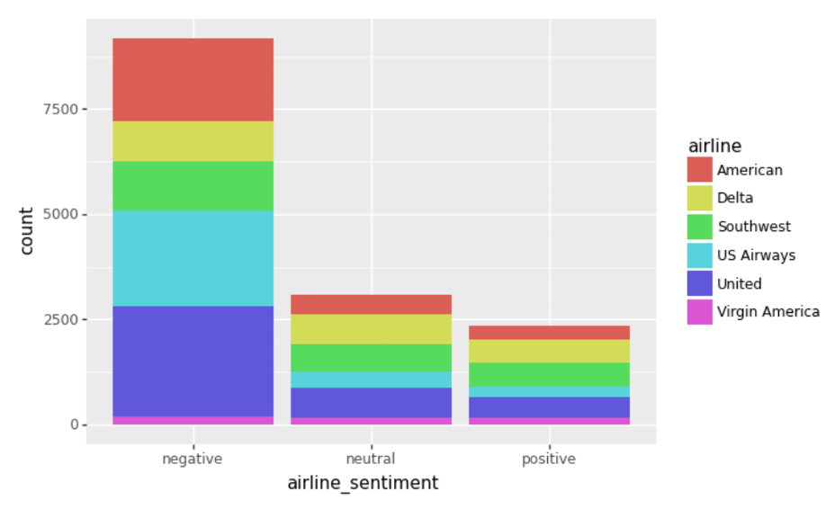
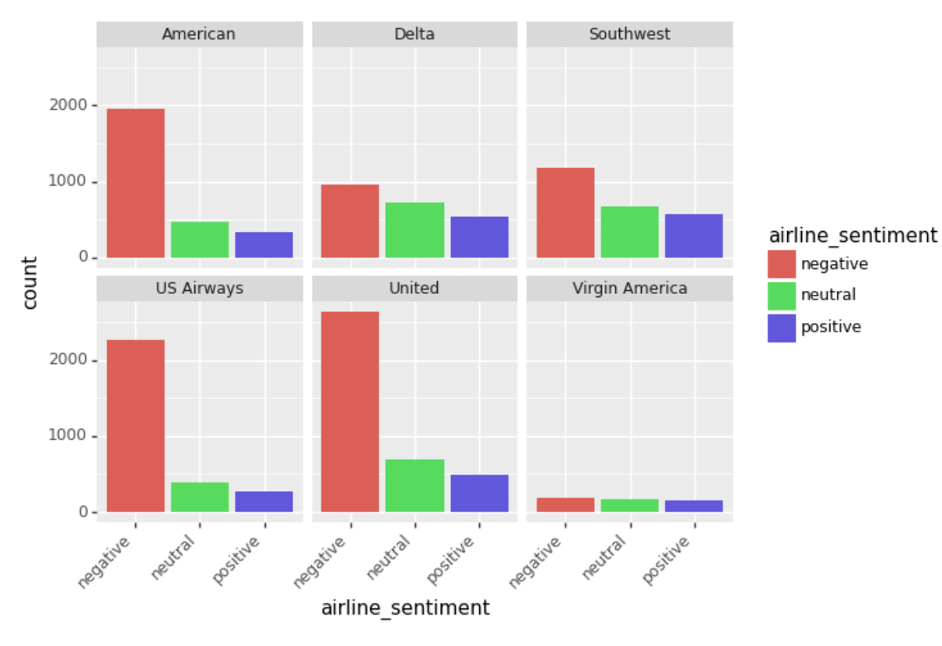
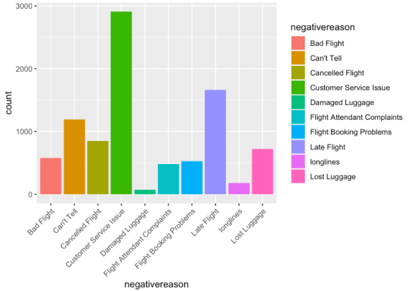
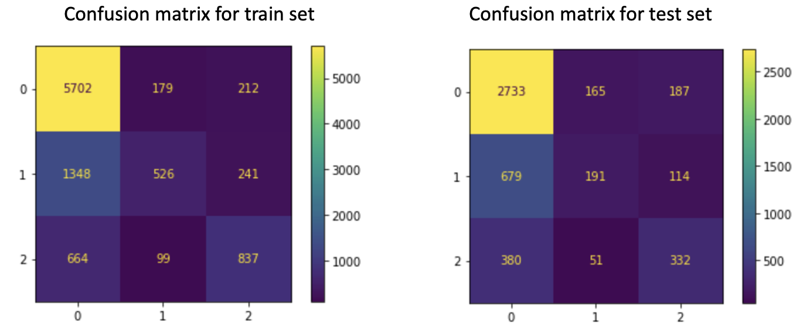
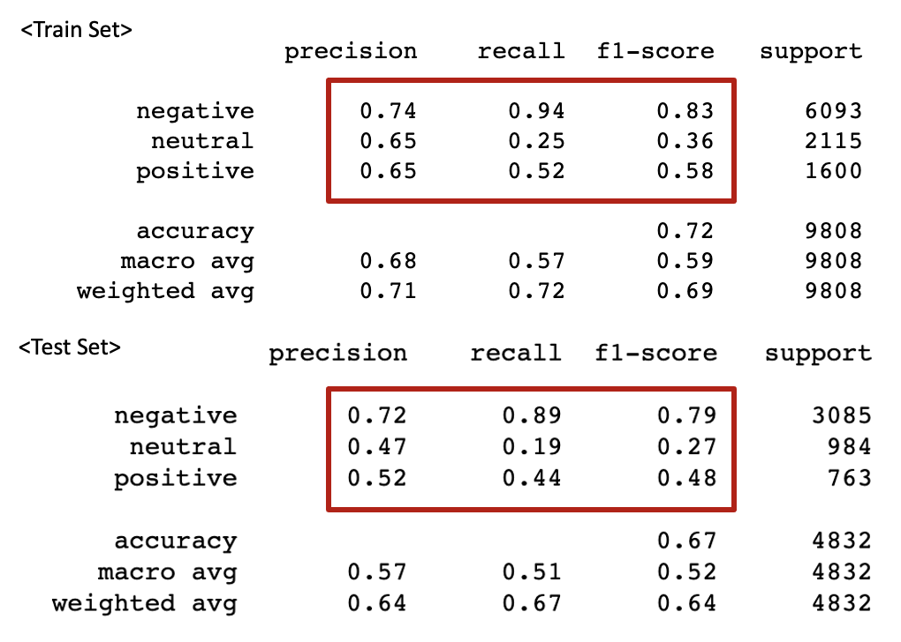
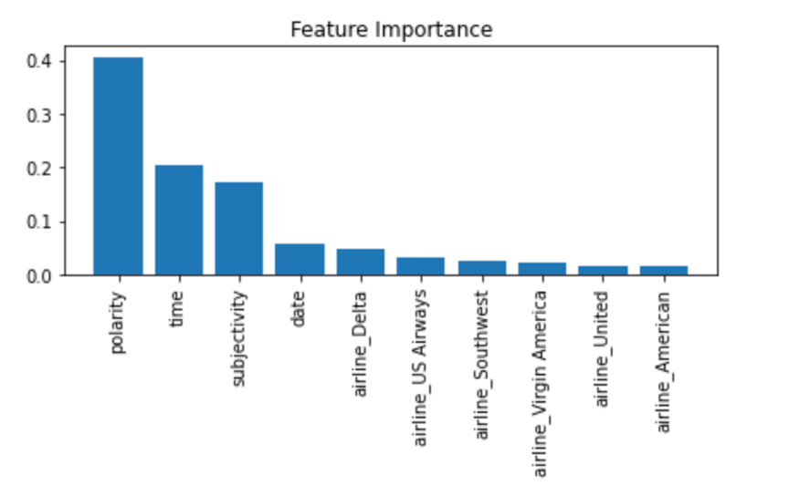

# ✈️ Airline Sentiment Analysis

## 📚 Table of Contents
1. [📌 Overview](#-overview)
2. [🧹 Data Preparation](#-data-preparation)
3. [📊 Exploratory Data Analysis](#-exploratory-data-analysis)
4. [🤖 Modeling](#-modeling)
5. [📈 Evaluation](#-evaluation)
6. [🔍 Feature Importance](#-feature-importance)
7. [✅ Results Summary](#-results-summary)
8. [💡 Future Improvements](#-future-improvements)
9. [📁 Project Structure](#-project-structure)
10. [🙋‍♀️ Author](#-author)
11. [🖼️ Power BI Dashboard](#-power-bi-dashboard)

## 📌 Overview

This project analyzes the sentiment of airline customers from Twitter comment data using machine learning models.  

- **Problem Statement**:  
  Airline companies frequently receive customer feedback on platforms like Twitter.  
  These tweets reflect public opinion but are unstructured and voluminous, making it difficult for companies to understand and respond to them systematically.

- **Goal**:  
  This project aims to **build a machine learning model that can automatically classify the sentiment (positive, neutral, negative) of a tweet**, enabling better real-time monitoring of customer opinions.

- **Main Tools**:  
  Python, pandas, scikit-learn, TextBlob

- **Results Summary**:  
  The best-performing model was a Random Forest classifier (after hyperparameter tuning),  
  achieving **67.4% test accuracy**. Negative tweets were predicted most accurately, while neutral tweets were hardest to classify.

- **Project Duration**:  
  March – April 2024 (Chapman Course Project for MGSC 410)
  

## 🧹 Data Preparation

* **Dataset**: 14,640 tweets

* **Preprocessing**: 

	* Dropped features with >30% null values.

	* One-hot encoded the `airline` variable.

	* Converted time format of `tweet_created` variable into numeric `date` and `time` columns. 

	* Used sentiment analysis library, TextBlob, to extract `polarity` (positive or negative) and `subjectivity` (factual or opinionated) scores from tweet text.

* **Target**: `airline_sentiment`

* **Predictors**: `date`, `time`, `airline`, `polarity`, and `subjectivity`. 

## 📊 Exploratory Data Analysis

* Most tweets express **negative sentiment**. 

* **United Airlines** has the most negative tweets.

* Most common complaint: **poor customer service**.

## 🤖 Modeling

- Trained three machine learning models:
  - Logistic Regression
  - Decision Tree
  - Random Forest
- Used **GridSearchCV** for hyperparameter tuning.

* Before hyperparameter tuning:

| Model               | Train Accuracy| Test Accuracy |
|---------------------|---------------|---------------|
| Logistic Regression | 62.1%         | 63.8%         |
| Decision Tree       | 99.9%         | 57.7%         |
| Random Forest       | 99.9%         | 63.2%         |

* After hyperparameter tuning:

| Model               | Train Accuracy | Test Accuracy |
|---------------------|----------------|---------------|
| Logistic Regression | 62.1%          | 63.8%         |
| Decision Tree       | 69.1%          | 66.7%         |
| Random Forest       | **72.0%**      | **67.4%**     |

- Random Forest outperformed others after tuning.

## 📈 Evaluation

- Evaluated random forest model performance with accuracy, confusion matrix, and classification metrics.

- **Negative tweets** were easiest to classify.

- **Neutral tweets** had the lowest precision/recall, likely due to class imbalance.

## 🔍 Feature Importance

Random Forest’s top features:
1. **Polarity**
2. **Time of tweet**
3. **Subjectivity**

## ✅ Results Summary

- The **best model** was a **Random Forest classifier** with hyperparameter tuning.
- **Test accuracy**: **67.4%**
- The model predicted **negative tweets** most accurately.
- Top 3 predictive features:
  1. Polarity
  2. Time of tweet
  3. Subjectivity
  

## 💡 Future Improvements

- Use **TF-IDF**, `CountVectorizer`, or **BERT embeddings** instead of TextBlob.

- Balance the dataset to improve prediction of neutral/positive classes.

- Deploy the model as a REST API using **Flask** or **FastAPI**.

- Build a real-time dashboard with **Streamlit**.

## 📁 Project Structure 

<pre><code>
airline-sentiment-analysis/
├── data/         # Dataset (Tweets.csv)
├── notebooks/    # Jupyter notebook for EDA & modeling
├── results/      # Visualizations (charts, screenshots)
├── docs/         # Presentation & appendix files
├── misc/         # R project or others
└── README.md     # Project summary
</code></pre>

## 🙋‍♀️ Author 

- Email: kyuna219@gmail.com
- LinkedIn: [https://www.linkedin.com/in/yuna-kim-/](https://www.linkedin.com/in/yuna-kim-/)
- GitHub: [github.com/datawithyuna](https://github.com/datawithyuna)
- 📌 Note: The dataset was originally obtained from a course project. Some inconsistencies or limitations may exist.

## 🖼️ Power BI Dashboard
- PowerBI: [https://app.powerbi.com/view?r=eyJrIjoiYmVlOWI4NjgtNjM4Zi00ZDkwLWE3ZmEtNDRiYThiZTA3OTUwIiwidCI6IjgwOTkyOWFmLTJkMjUtNDViZi05ODM3LTA4OWViOWNmYmQwMSIsImMiOjZ9]
